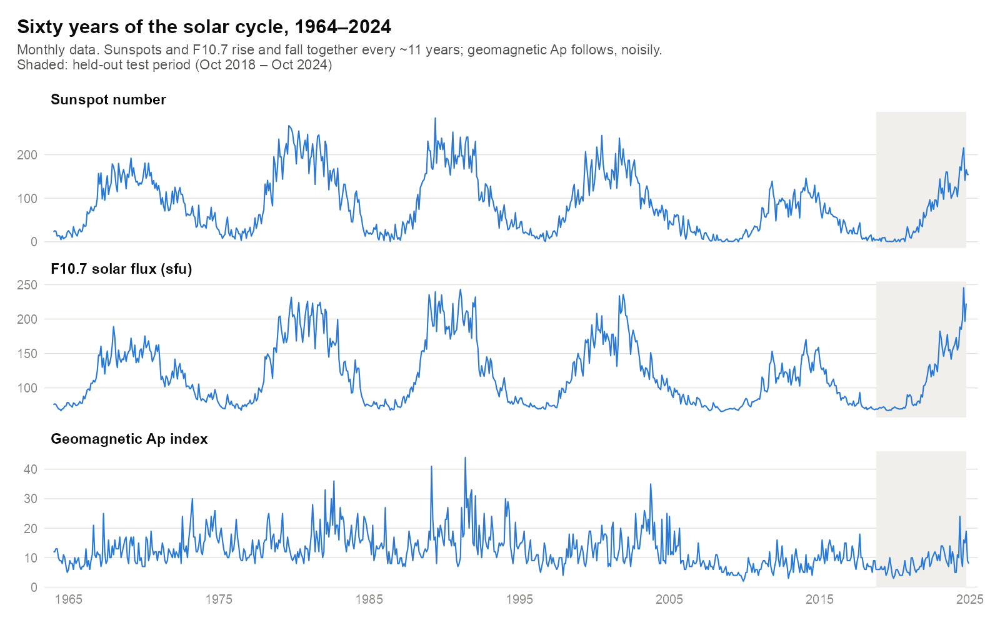
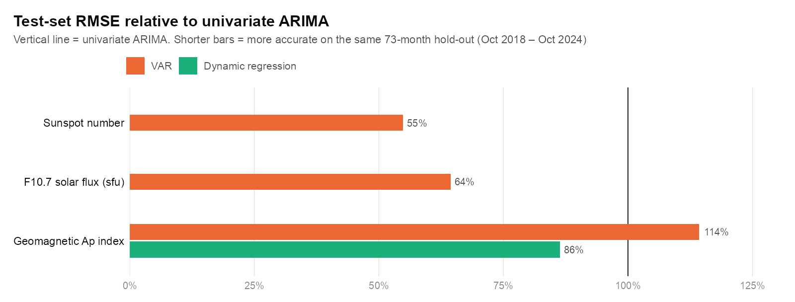
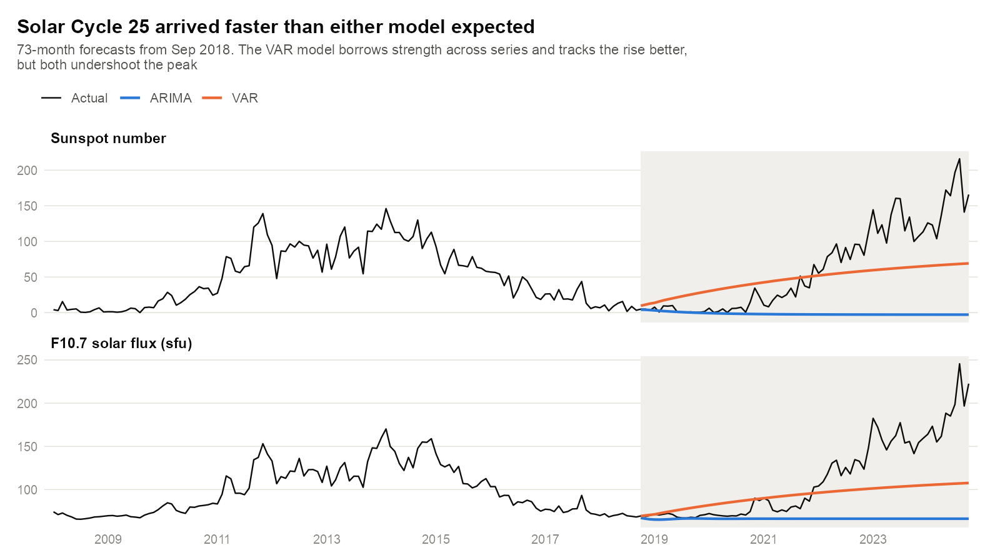
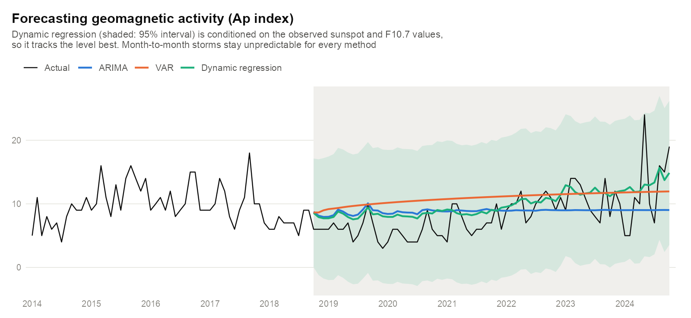

# Solar Activity & Geomagnetic Forecasting


Sixty years of monthly space-weather data (sunspots, solar radio flux and Earth's geomagnetic disturbance), forecast six years ahead with three competing approaches: univariate ARIMA, a vector autoregression and a dynamic regression. The question is simple: **does knowing what the Sun is doing help predict what happens at Earth?**

<picture>
  <source media="(prefers-color-scheme: dark)" srcset="assets/solar_cycle_dark.png">
  
</picture>

## Key findings

Train: Jan 1964 – Sep 2018 (657 months) · Test: Oct 2018 – Oct 2024 (73 months, the rise of Solar Cycle 25)

- **Modelling the series jointly cuts solar-activity error by a third to a half.** A VAR(4) that lets sunspots, F10.7 and Ap inform each other beat univariate ARIMA by **45%** on sunspot RMSE and **36%** on F10.7.
- **Solar activity explains geomagnetic activity.** A dynamic regression of Ap on sunspots and F10.7 was the most accurate Ap model: test RMSE **3.15**, 14% better than ARIMA, and 14.65 AIC points better on the same training data.
- **More structure isn't always better.** For Ap the VAR was the *least* accurate method, 14% worse than ARIMA. Ap only correlates 0.34 with the solar series, so the extra lags mostly add noise.
- **Every model undershot Cycle 25.** Six-year forecasts from a solar minimum can't anticipate how strong the next maximum will be. ARIMA reverts to a flat line, and the VAR rises but tops out far below the real peak.

## Results

<picture>
  <source media="(prefers-color-scheme: dark)" srcset="assets/rmse_comparison_dark.png">
  
</picture>

| Series | Univariate ARIMA | VAR(4) | Dynamic regression |
|---|---:|---:|---:|
| Sunspot number | 88.4 | **48.5** | — |
| F10.7 solar flux (sfu) | 65.5 | **42.2** | — |
| Geomagnetic Ap index | 3.65 | 4.17 | **3.15** |

*Test-set RMSE over the same 73-month hold-out. MAE and MAPE for every model are in the [full report](report/finalreport.md).*

### Solar activity: ARIMA vs. VAR

<picture>
  <source media="(prefers-color-scheme: dark)" srcset="assets/solar_forecasts_dark.png">
  
</picture>

### Geomagnetic activity: all three methods

<picture>
  <source media="(prefers-color-scheme: dark)" srcset="assets/ap_forecasts_dark.png">
  
</picture>

> **Note:** The dynamic regression forecast is *conditional*. It uses the observed sunspot and F10.7 values from the test period as inputs, so it shows how well solar activity explains Ap, not how well Ap can be forecast with no future information. A real-time version would need forecasts of the covariates too.

## Background: the solar cycle

The Sun's magnetic activity swings between minimum and maximum roughly every 11 years, and the effects reach Earth through a chain of cause and effect:

| Series | What it measures | Role |
|---|---|---|
| **Sunspot number** | Dark, magnetically active patches on the Sun, counted continuously since 1749 | Solar activity |
| **F10.7 solar flux** | Solar radio emission at 10.7 cm, measured daily at Penticton, BC | Solar activity (automatic proxy for sunspots) |
| **Ap index** | Daily disturbance of Earth's magnetic field by the solar wind | Geomagnetic response: storms can disrupt GPS, satellites and power grids |

Sunspots and F10.7 are nearly the same signal (correlation 0.97), while Ap is much noisier (0.34 with each). That contrast explains most of the results above.

## Methods

| Approach | Model selected | Script |
|---|---|---|
| **Univariate ARIMA** | ADF/KPSS tests, ACF/PACF, and exhaustive `auto.arima` by AIC against hand-picked candidates. Result: ARIMA(2,1,2) for sunspots and F10.7, SARIMA(1,1,2)(2,0,0)[12] for Ap | [`R/univariate.R`](R/univariate.R) |
| **Vector autoregression** | Cross-correlation matrix, then VAR(1)–VAR(4) compared by AIC → **VAR(4)** | [`R/varima.R`](R/varima.R) |
| **Dynamic regression** | Ap ~ sunspots + F10.7 with ARIMA errors → **regression with SARIMA(1,1,2)(2,0,0)[12] errors** | [`R/dynamicregression.R`](R/dynamicregression.R) |

Every method uses the same split, with the last 10% of months held out. Residual diagnostics, fitted equations, AIC tables and the discussion of each model are in the **[full report](report/finalreport.md)**.

## Reproducing

Requires R 4.x. The repo includes a [dev container](.devcontainer/devcontainer.json) (RStudio on port 8787) that installs every package, or install them yourself:

```r
install.packages(c("tidyr", "dplyr", "forecast", "tseries", "urca", "MTS", "ggplot2"))
```

Run from the repository root:

```bash
Rscript R/dataprep.R            # merge the three raw sources → data/solar_data_clean.csv
Rscript R/univariate.R          # ARIMA per series            (~1 min)
Rscript R/varima.R              # VAR(1–4)
Rscript R/dynamicregression.R   # Ap ~ sunspots + F10.7       (~1 min)
Rscript R/figures.R             # README charts → assets/
```

Diagnostic plots from each script go to `output/`, and so do the test-set forecasts (`output/forecast_*.csv`) that `figures.R` reads.

## Data sources

| Dataset | Source |
|---|---|
| Monthly mean total sunspot number | [WDC-SILSO, Royal Observatory of Belgium](https://www.sidc.be/silso/datafiles) |
| Monthly F10.7 solar flux | [NOAA Physical Sciences Laboratory](https://psl.noaa.gov/data/correlation/solar.csv) (stored in 0.1 sfu) |
| Monthly Ap index | [GFZ Helmholtz Centre for Geosciences, Potsdam](https://kp.gfz.de/en/data) |

*Originally completed for STT 592.*
