# Solar Activity & Geomagnetic Forecasting — Final Report

# 1. Univariate Time Series Analysis

## Data Overview

The training set consists of 659 monthly observations spanning January 1964 to November
2018. The test set consists of 73 monthly observations spanning December 2018 to December
2024. Each series was modeled independently using ARIMA or SARIMA.

---

## 1.1 Sunspot Number

### Time Series Plot

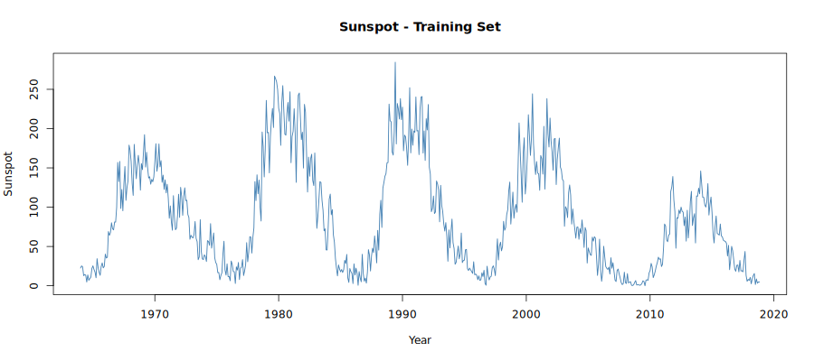

The Sunspot Number time series exhibits a clear and repeating cyclical pattern consistent
with the well-known 11-year solar cycle. The series oscillates between near-zero values
during solar minimum and peaks exceeding 250 during solar maximum. Notable peaks are
visible around 1979, 1989, and 2000, with a weaker cycle peaking around 2014. The series
is clearly non-stationary due to this long-period cyclical behavior, and variance appears
roughly constant across the series.

### ACF and PACF

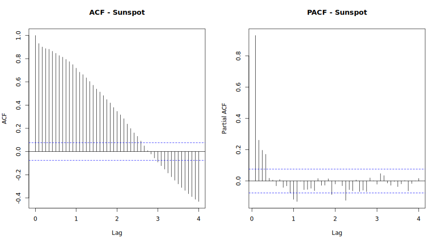

The ACF decays very slowly and remains significant across many lags, indicating strong
positive autocorrelation and confirming that the series is non-stationary. The slow sinusoidal
decay pattern in the ACF reflects the underlying 11-year cycle. The PACF shows two
significant spikes at lags 1 and 2, with all subsequent lags falling within the confidence
bounds. This pattern suggests an AR(2) process may be appropriate after differencing.

### Stationarity Tests

| Test | p-value | Conclusion |
|---|---|---|
| ADF | 0.3263 | Non-stationary (fail to reject H0) |
| KPSS | 0.0143 | Non-stationary (reject H0) |

Both tests agree that the Sunspot series is non-stationary, consistent with the visual
inspection. First differencing is required before fitting an ARIMA model.

### Candidate Model Comparison

| Model | AIC |
|---|---|
| ARIMA(2,1,2) — auto.arima | **5991.91** |
| ARIMA(2,1,1) | 6007.57 |
| ARIMA(1,1,1) | 6009.80 |
| ARIMA(0,1,1) | 6016.08 |
| ARIMA(1,1,0) | 6057.51 |
| ARIMA(0,1,0) | 6114.76 |

The ARIMA(2,1,2) model selected by `auto.arima` produced the lowest AIC of 5991.91,
outperforming all candidate models. This model includes one degree of differencing to
achieve stationarity, along with AR(2) and MA(2) terms to capture the short-term
autocorrelation structure.

### Final Model

**ARIMA(2,1,2)**

$$\hat{y}_t = 1.2534 y_{t-1} - 0.3085 y_{t-2} - 1.6985 \varepsilon_{t-1} + 0.7446 \varepsilon_{t-2}$$

- AIC: 5991.91
- σ² = 522.4

The Ljung-Box test on the residuals returned a p-value of 0.3036, indicating no significant
autocorrelation remaining in the residuals. The residual plot shows approximately white noise
behavior, confirming the model adequately captures the structure in the data.

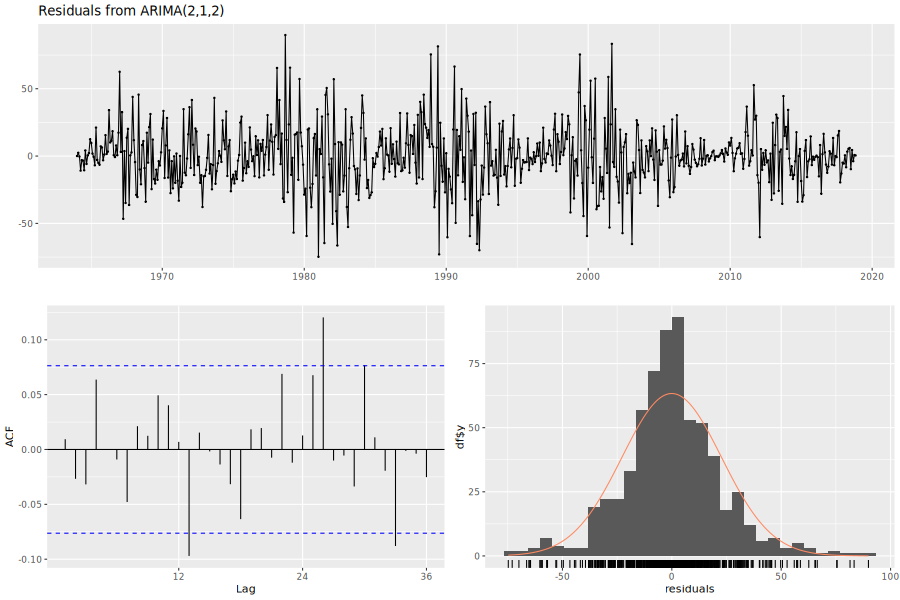

### Forecasts

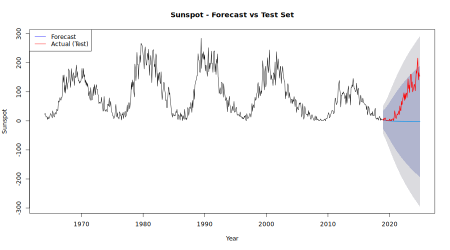

### Accuracy Measures

| Set | RMSE | MAE | MAPE |
|---|---|---|---|
| Training | 22.77 | 16.47 | — |
| Test | 91.37 | 67.56 | 104.13% |

The high MAPE on the test set is largely a result of near-zero sunspot values during solar
minimum — small absolute errors become very large percentage errors when the denominator
approaches zero. RMSE and MAE are more informative here.

---

## 1.2 Solar Flux (F10.7 Index)

### Time Series Plot

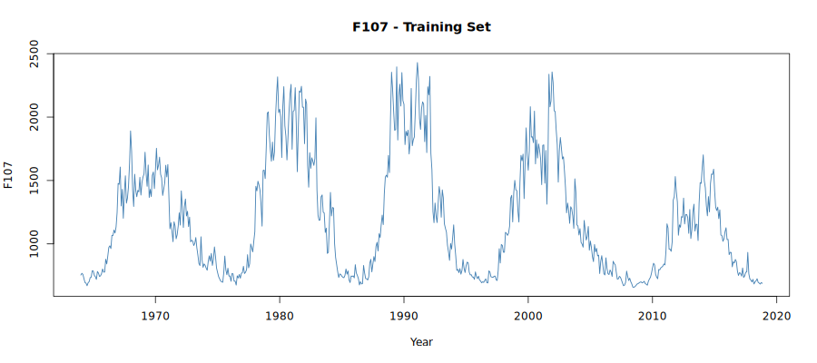

The F10.7 Solar Flux series closely mirrors the Sunspot Number, exhibiting the same 11-year
cyclical pattern. Values range from approximately 700 sfu at solar minimum to over 2400 sfu
at solar maximum. The series is non-stationary with a strong periodic structure. The cycles
follow the same timing as sunspots, which is expected given the physical relationship between
these two measures of solar activity.

### ACF and PACF

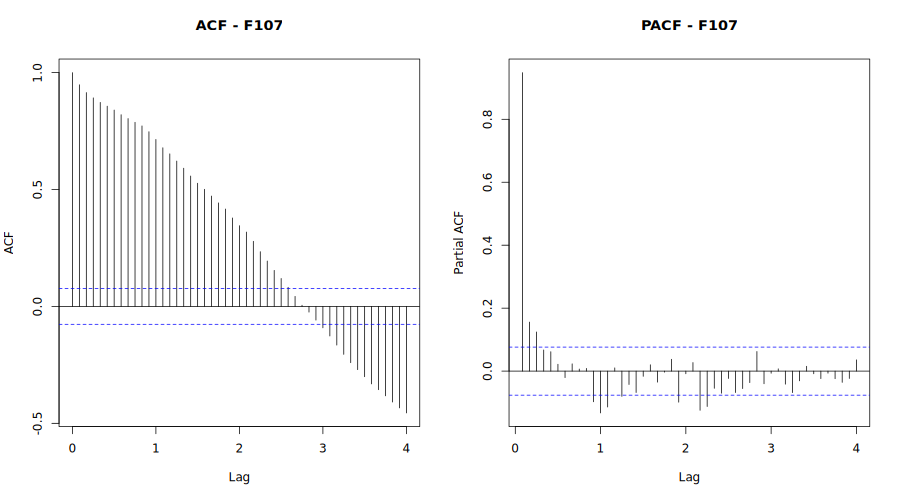

Similar to the Sunspot series, the ACF of F10.7 shows a very slow decay with significant
autocorrelations persisting across all 48 lags shown, confirming non-stationarity. A gradual
sinusoidal oscillation is also visible, reflecting the solar cycle. The PACF drops sharply
after lag 1 with a secondary spike at lag 2, again suggesting an AR(2) structure after
differencing.

### Stationarity Tests

| Test | p-value | Conclusion |
|---|---|---|
| ADF | 0.3513 | Non-stationary (fail to reject H0) |
| KPSS | 0.0468 | Non-stationary (reject H0) |

Both tests confirm non-stationarity, consistent with the visual inspection and ACF behavior.

### Candidate Model Comparison

| Model | AIC |
|---|---|
| ARIMA(2,1,2) — auto.arima | **8360.42** |
| ARIMA(1,1,1) | 8371.91 |
| ARIMA(2,1,1) | 8372.91 |
| ARIMA(0,1,1) | 8383.20 |
| ARIMA(1,1,0) | 8392.31 |
| ARIMA(0,1,0) | 8412.66 |

The ARIMA(2,1,2) model again produced the lowest AIC of 8360.42, consistent with the
similar autocorrelation structure of F10.7 and Sunspot Number.

### Final Model

**ARIMA(2,1,2)**

$$\hat{y}_t = 1.5383 y_{t-1} - 0.7126 y_{t-2} - 1.7498 \varepsilon_{t-1} + 0.8801 \varepsilon_{t-2}$$

- AIC: 8360.42
- σ² = 19,110

The Ljung-Box test returned a p-value of 0.0313, which is below 0.05, suggesting some
remaining autocorrelation in the residuals. This indicates the model does not fully capture
all structure in the F10.7 series, likely due to the long solar cycle period being difficult
to model with a simple ARIMA structure.

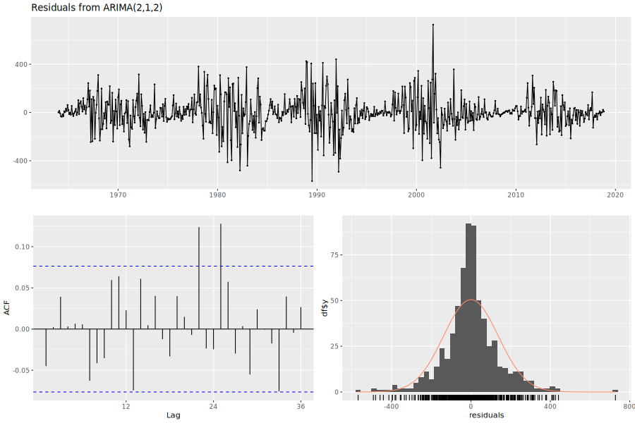

### Forecasts

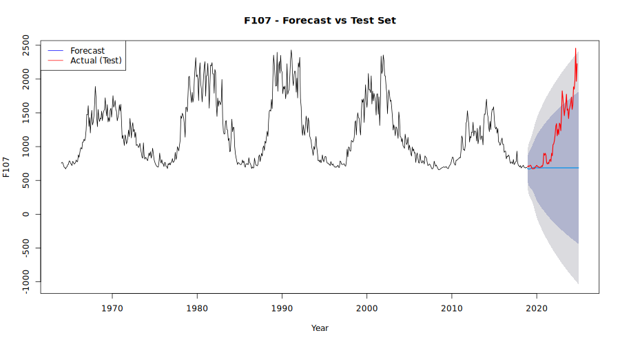

### Accuracy Measures

| Set | RMSE | MAE | MAPE |
|---|---|---|---|
| Training | 137.71 | 94.89 | 7.29% |
| Test | 647.65 | 456.78 | 30.58% |

The test set errors are substantially larger than the training errors, indicating the univariate
model struggles to forecast F10.7 over the 73-month test horizon. The Theil's U statistic
of 4.68 confirms the model performs worse than a naive forecast over the test period.

---

## 1.3 Geomagnetic Ap Index

### Time Series Plot

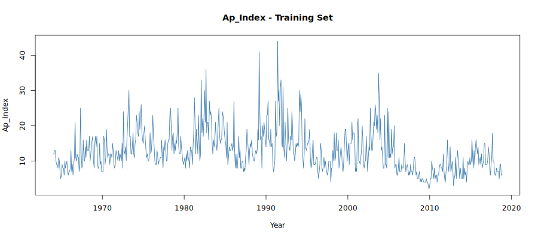

The Ap Index series behaves quite differently from the Sunspot and F10.7 series. While there
is a general tendency for elevated activity during solar maximum periods, the series is much
noisier with frequent large spikes. The most notable spike occurs around 1989-1991, coinciding
with Solar Cycle 22 maximum. The series also shows a prolonged quiet period around 2008-2010
corresponding to the unusually deep solar minimum between cycles 23 and 24. Overall the series
appears more stationary than Sunspot or F10.7, with no clear long-term trend.

### ACF and PACF

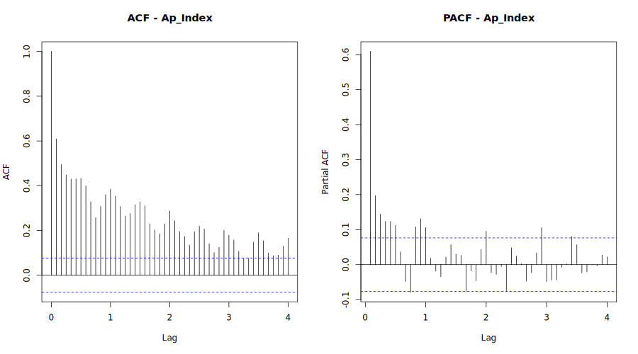

The ACF of the Ap Index decays much more rapidly than the solar activity series, dropping
below the significance threshold within approximately 10 lags. However, a persistent low-level
oscillation remains visible well beyond lag 1, suggesting weak seasonal structure at the annual
scale. The PACF shows a significant spike at lag 1 followed by several smaller significant
spikes, suggesting an AR process of low order may be appropriate. The faster ACF decay
compared to Sunspot and F10.7 is consistent with the mixed stationarity test results.

### Stationarity Tests

| Test | p-value | Conclusion |
|---|---|---|
| ADF | 0.0100 | Stationary (reject H0) |
| KPSS | 0.0100 | Non-stationary (reject H0) |

The ADF and KPSS tests give conflicting results for the Ap Index. The ADF test suggests
stationarity while the KPSS test suggests non-stationarity. This conflict is not unusual for
series with cyclical structure and is consistent with the visual inspection — the series has
no clear trend but exhibits long-period oscillations driven by the solar cycle. The
`auto.arima` function handles this by selecting one degree of differencing.

### Candidate Model Comparison

| Model | AIC |
|---|---|
| ARIMA(1,1,2)(2,0,0)[12] — auto.arima | **3830.16** |
| ARIMA(1,1,1) | 3843.33 |
| ARIMA(2,1,1) | 3845.00 |
| ARIMA(0,1,1) | 3870.02 |
| ARIMA(1,1,0) | 3956.52 |
| ARIMA(0,1,0) | 4042.78 |

`auto.arima` selected a seasonal ARIMA model — ARIMA(1,1,2)(2,0,0)[12] — which
outperformed all non-seasonal candidates by a significant margin. This confirms the presence
of annual seasonal structure in the Ap Index that a non-seasonal model cannot adequately
capture.

### Final Model

**ARIMA(1,1,2)(2,0,0)[12]**

$$\hat{y}_t = 0.8325 y_{t-1} - 1.4700 \varepsilon_{t-1} + 0.4783 \varepsilon_{t-2} + 0.1217 y_{t-12} + 0.1351 y_{t-24}$$

- AIC: 3830.16
- σ² = 19.48

The Ljung-Box test returned a p-value of 0.0038, indicating some remaining autocorrelation
in the residuals. Despite this, the model provides a reasonable fit and its AIC is
substantially lower than all non-seasonal alternatives.

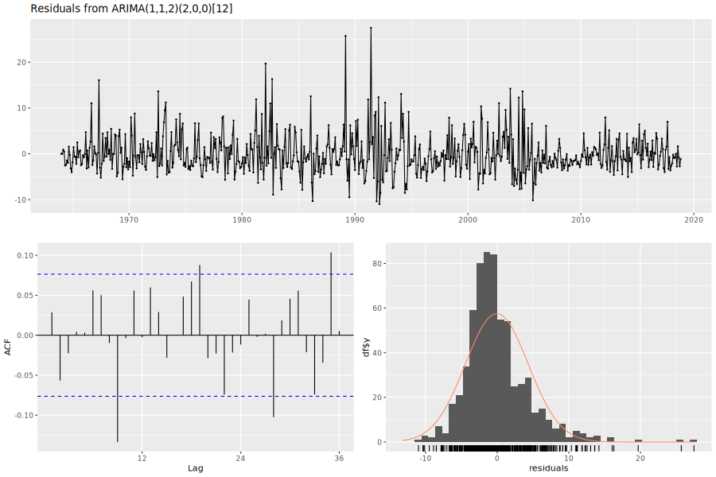

### Forecasts

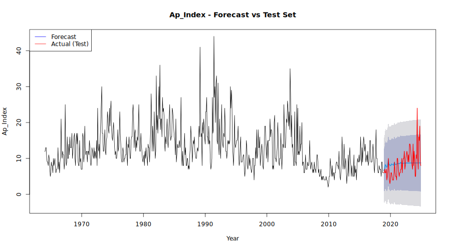

### Accuracy Measures

| Set | RMSE | MAE | MAPE |
|---|---|---|---|
| Training | 4.39 | 3.16 | 26.63% |
| Test | 3.54 | 2.66 | 37.02% |

Notably, the test set RMSE (3.54) is slightly lower than the training RMSE (4.39), suggesting
the model generalizes well to the test period. The Theil's U of 1.18 indicates performance
slightly worse than a naive forecast, which is reasonable given the inherent unpredictability
of geomagnetic activity.

---

# 2. Vector ARIMA Analysis

## 2.1 Cross-Correlation Matrix (CCM)

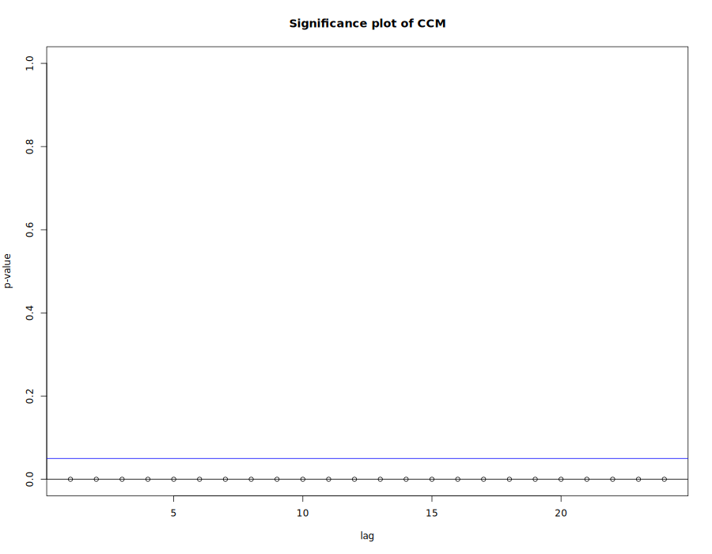

Before fitting a vector model, the cross-correlation matrix (CCM) was examined to assess
whether the three series are meaningfully related across lags. The significance plot of the
CCM shows p-values essentially equal to zero at every lag up to lag 24, far below the 0.05
significance threshold. This confirms that all three series — Sunspot Number, F10.7, and
Ap Index — are highly significantly cross-correlated with each other at every lag examined.
This strong cross-series dependence justifies the use of a vector ARIMA model, as each
series contains useful predictive information about the others.

## 2.2 Model Selection

VAR models of orders 1 through 4 were fitted to the combined training set matrix and
compared using AIC:

| Model | AIC |
|---|---|
| VAR(1) | 18.075 |
| VAR(2) | 17.995 |
| VAR(3) | 17.951 |
| VAR(4) | **17.913** |

The VAR(4) model produced the lowest AIC of 17.913 and was selected as the final model.
This means each series is modeled as a linear function of its own four most recent lags and
the four most recent lags of the other two series — 12 predictors per equation in total.

## 2.3 Final Model

The VAR(4) model includes three equations, one for each series. The AR coefficient matrices
show that past values of Sunspot Number and F10.7 have meaningful cross-predictive effects
on each other, while the Ap Index is primarily driven by its own past values with smaller
contributions from the solar activity series. The residual covariance matrix confirms strong
positive correlation between the Sunspot and F10.7 residuals (2583), as expected given their
shared physical origin, while Ap residuals are less correlated with the other two series.

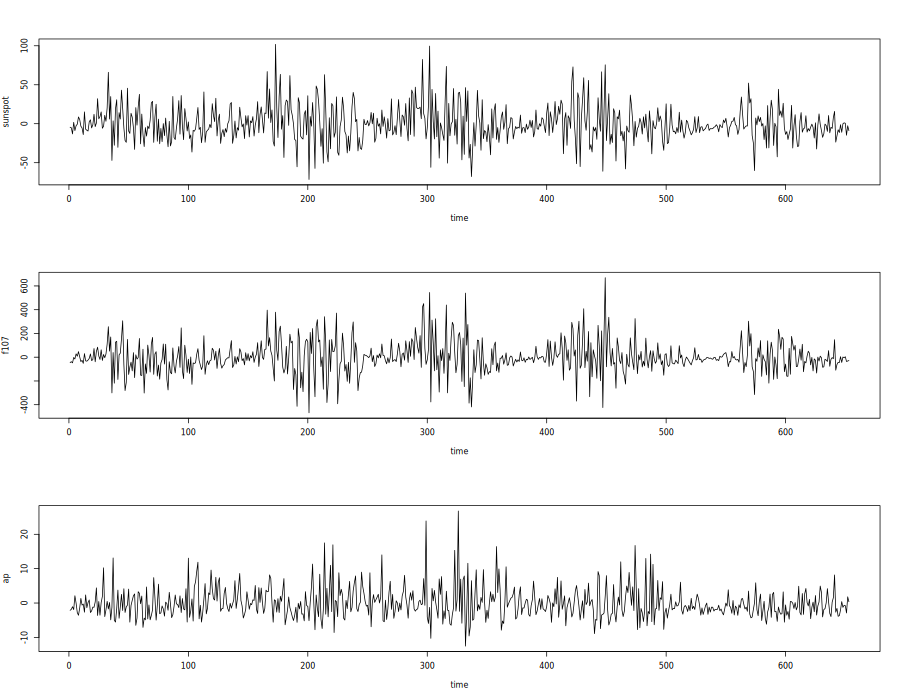

## 2.4 Forecasts

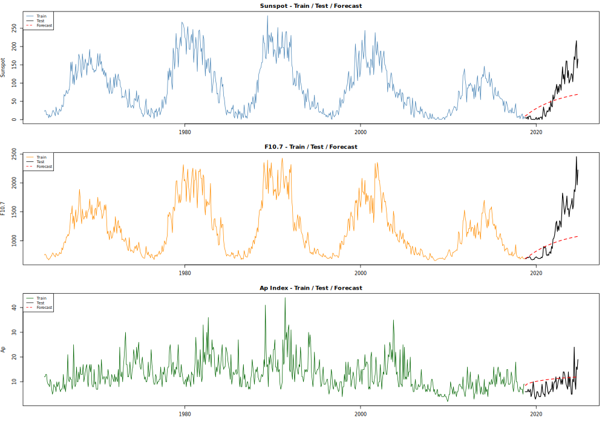

The forecast overlay plot shows the training series (colored), test set (black), and VAR(4)
forecasts (red dashed) for all three series. For both Sunspot and F10.7, the test period
coincides with the rising phase of Solar Cycle 25, which saw a faster and stronger recovery
than anticipated. The VAR forecasts follow a gradual upward trend but significantly
underestimate the magnitude of this recovery, particularly for F10.7. For the Ap Index, the
VAR forecast predicts a slow steady increase but misses the short-term variability present
in the actual test series.

## 2.5 Accuracy Measures

### Test Set Accuracy

| Series | RMSE | MAE | MAPE |
|---|---|---|---|
| Sunspot | 48.48 | 37.95 | 1020.11% |
| F10.7 | 421.58 | 298.66 | 21.72% |
| Ap Index | 4.17 | 3.52 | 57.65% |

The VAR model outperforms the univariate model for both Sunspot (RMSE 48.48 vs 91.37)
and F10.7 (RMSE 421.58 vs 647.65), suggesting that cross-series information improves
forecasting for the solar activity variables. For the Ap Index, the VAR model performs
slightly worse than the univariate model (RMSE 4.17 vs 3.54), indicating that the added
complexity of the vector model does not benefit Ap forecasting as much as modeling it
individually or with a dynamic regression approach.

The extremely high MAPE for Sunspot (1020%) is again due to near-zero values during
solar minimum at the start of the test period — RMSE and MAE are more appropriate
measures for this series.

---

# 3. Dynamic Regression Analysis

## 3.1 Model Setup

The dynamic regression model uses **Ap Index as the response variable** and
**Sunspot Number and F10.7 as covariates**. This choice reflects the known physical
causal structure — solar activity (measured by sunspots and F10.7) directly drives
geomagnetic disturbances (measured by Ap). The model was fit using `auto.arima` with
the `xreg` argument on the training set, allowing the error structure to be modeled
as an ARIMA process after accounting for the linear effect of the covariates.

## 3.2 Model Selection

Candidate models were compared by fitting ARIMA error structures of various orders with
the two covariates included. The best model selected by `auto.arima` was:

**Regression with ARIMA(1,1,2)(2,0,0)[12] errors**

- AIC: 3805.45

This model improves on the univariate Ap ARIMA model (AIC: 3830.16) by 24.71 AIC points,
confirming that the solar activity covariates provide meaningful additional explanatory power
beyond what the ARIMA error structure alone can capture.

## 3.3 Final Model

The fitted model equation is:

$$\text{Ap}_t = -0.0081 \cdot \text{Sunspot}_t + 0.0052 \cdot \text{F10.7}_t + \eta_t$$

where $\eta_t$ follows an ARIMA(1,1,2)(2,0,0)[12] process:

$$\eta_t = 0.8144\eta_{t-1} - 1.4485\varepsilon_{t-1} + 0.4551\varepsilon_{t-2} + 0.1288\eta_{t-12} + 0.1369\eta_{t-24}$$

The coefficient on F10.7 (0.0052) is positive, indicating that higher solar flux is
associated with higher geomagnetic activity, which is physically consistent. The negative
coefficient on Sunspot (-0.0081) may reflect the high multicollinearity between Sunspot and
F10.7 — since both measure solar activity, their individual coefficients can be difficult
to interpret in isolation. The seasonal AR terms at lags 12 and 24 capture the annual
periodicity in geomagnetic activity.

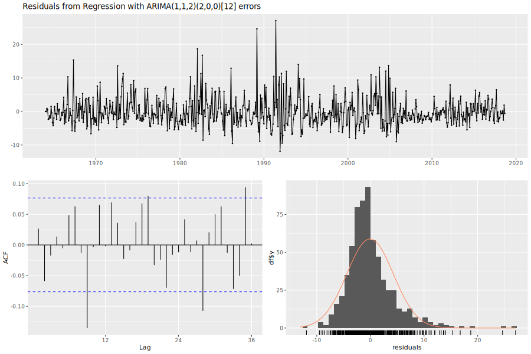

## 3.4 Forecasts

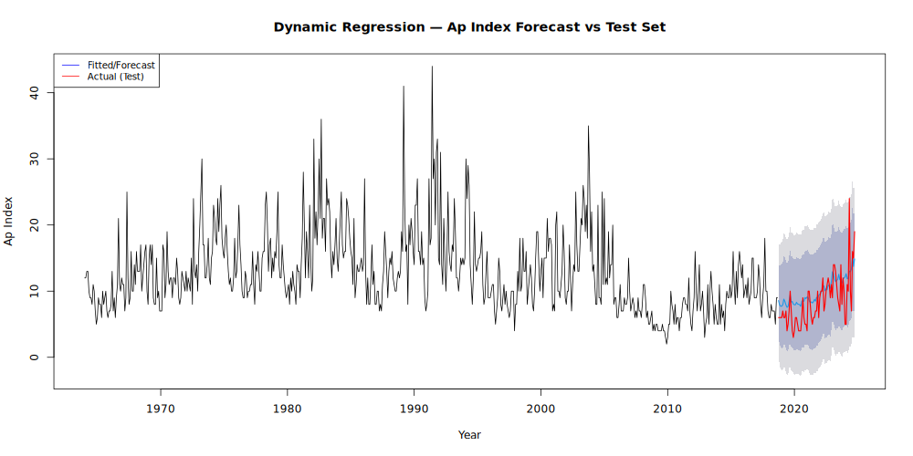

The dynamic regression forecast plot shows the full training series (black), the forecast
and fitted values (blue), the actual test values (red), and the 80% and 95% prediction
intervals (shaded). The forecast tracks the general level of the test period reasonably
well, with the actual Ap values mostly falling within or near the prediction intervals.
The model correctly captures the modest increase in geomagnetic activity during Solar
Cycle 25, driven by the rising Sunspot and F10.7 values provided as covariates in the
test set. This is a key advantage of dynamic regression — the model can leverage the
known covariate values to produce more informed forecasts.

## 3.5 Accuracy Measures

### Test Set Accuracy

| Set | RMSE | MAE | MAPE |
|---|---|---|---|
| Test | 3.29 | 2.72 | 43.44% |

### Train Set Accuracy

| Set | RMSE | MAE | MAPE |
|---|---|---|---|
| Training | 4.34 | 3.12 | 26.40% |

The dynamic regression model achieves the lowest test RMSE (3.29) of all three methods
applied to the Ap Index, outperforming both the univariate ARIMA (RMSE 3.54) and the
VAR model (RMSE 4.17). The training RMSE of 4.34 is also the lowest among methods for
this series, confirming that the covariates improve both in-sample fit and out-of-sample
forecasting for the Ap Index.

---

# 4. Model Comparison

## 4.1 Forecasting Accuracy (Test Set)

The table below summarizes the forecasting accuracy for each method on the held-out test set
(December 2018 – December 2024, 73 observations).

| Method | Series | RMSE | MAE | MAPE |
|---|---|---|---|---|
| Univariate ARIMA | Sunspot | 88.39 | 64.15 | 121.20% |
| Univariate ARIMA | F10.7 | 654.68 | 465.05 | 31.79% |
| Univariate ARIMA | Ap Index | 3.65 | 2.84 | 41.43% |
| Vector ARIMA (VAR) | Sunspot | 48.48 | 37.95 | 1020.11% |
| Vector ARIMA (VAR) | F10.7 | 421.58 | 298.66 | 21.72% |
| Vector ARIMA (VAR) | Ap Index | 4.17 | 3.52 | 57.65% |
| Dynamic Regression | Ap Index | 3.29 | 2.72 | 43.44% |

## 4.2 In-Sample Fit Accuracy (Train Set)

| Method | Series | RMSE |
|---|---|---|
| Univariate ARIMA | Sunspot | 22.80 |
| Univariate ARIMA | F10.7 | 137.92 |
| Univariate ARIMA | Ap Index | 4.40 |
| Dynamic Regression | Ap Index | 4.34 |

## 4.3 Discussion

### Which method produces better forecasts?

The results are mixed across the three series, and no single method dominates uniformly.

For **Sunspot Number**, the Vector ARIMA model produced noticeably better point forecasts
than the univariate model (RMSE of 48.48 vs 88.39, MAE of 37.95 vs 64.15), suggesting that
incorporating information from the correlated F10.7 and Ap series helped the VAR model track
the test period more closely. The MAPE for Sunspot is extremely high across both methods
(121% univariate, 1020% VAR), which reflects the fact that sunspot counts pass through near-zero
values during solar minimum — making percentage errors artificially large and not a reliable
measure of forecast quality for this series. RMSE and MAE are more appropriate here.

For **F10.7 Solar Flux**, the VAR model also outperformed the univariate model in terms of
RMSE (421.58 vs 654.68) and MAE (298.66 vs 465.05), again indicating that cross-series
information improved forecasting. The MAPE of 21.72% for VAR vs 31.79% for univariate
further supports this conclusion.

For **Ap Index**, the Dynamic Regression model produced the best forecasts, with the lowest
RMSE (3.29) and MAE (2.72) among all methods tested for this series. This is not surprising
given the physical relationship between the variables — Sunspot Number and F10.7 are direct
measures of solar output and are strong predictors of geomagnetic activity. By explicitly
incorporating these as covariates, the dynamic regression model was able to leverage this
causal structure in a way that neither the univariate model nor the VAR model could replicate
as effectively.

Overall, the **Dynamic Regression model produced the best forecasts for the Ap Index**,
and the **Vector ARIMA model produced the best forecasts for Sunspot and F10.7**.

### Which method produces better in-sample fit?

For the Ap Index, the Dynamic Regression model achieved a slightly lower train set RMSE
(4.34) compared to the univariate ARIMA (4.40), indicating a marginally better in-sample fit.
This improvement is modest, suggesting that the covariates help more with out-of-sample
forecasting than with fitting the training data — likely because the ARIMA error structure in
both models captures most of the short-term autocorrelation in Ap regardless of the covariates.

### Why do we obtain these results?

These results are consistent with the known physical relationships among the three variables.
Sunspot Number and F10.7 are both measures of solar activity and are highly correlated with
each other and with Ap. The 11-year solar cycle dominates all three series, creating strong
long-range autocorrelation that univariate ARIMA models struggle to fully capture without very
high-order terms. The VAR model benefits from cross-series information at each lag, which
helps it track cyclical turning points more accurately. The Dynamic Regression model goes
further by treating the solar activity variables as direct predictors of geomagnetic disturbance,
which reflects the true causal mechanism and produces the most accurate Ap forecasts.

The high MAPE values observed for Sunspot (across all methods) and Ap (for the VAR model)
are largely a consequence of the solar minimum periods in the test set, where values approach
zero and small absolute errors translate into very large percentage errors. These should be
interpreted cautiously — RMSE and MAE provide a more stable basis for comparison in this case.
